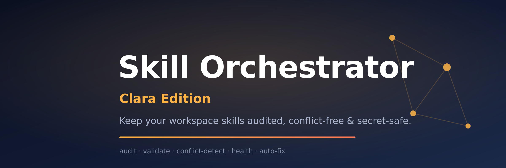

<div align="center">



# 🦞 Skill Orchestrator — Clara Edition

**Keep your workspace skills audited, conflict-free, and secret-safe.**

[](LICENSE)
[](https://openclaw.ai)
[](https://clawhub.ai)

[What it does](#what-it-does) ·
[Why it exists](#why-it-exists) ·
[Tools](#tools) ·
[Install](#install) ·
[Usage](#usage) ·
[Config](#configuration) ·
[Repo layout](#repo-layout) ·
[Local dev](#local-development) ·
[Notes](#notes)

</div>

---

## What it does

`skill-orchestrator` is a Clara-built OpenClaw plugin that turns a messy,
growing skill collection into a **maintained, conflict-free system**. When you
run many custom skills (as Bos does — 59+), they start to overlap, fight over
triggers, and occasionally leak secrets. This plugin finds and fixes that.

It ships **five tools**:

| Tool | What it does |
|------|--------------|
| `skill_audit` | Full inventory of every skill + validation + missing-dependency scan. |
| `skill_conflict_detect` | Finds trigger overlaps, similar triggers, description clashes, tool competition, and name collisions. |
| `skill_validate` | Validates every `SKILL.md` (YAML, required fields, trigger quality) **and scans for hardcoded secrets**. |
| `skill_health_report` | Combined audit + validation + conflict view with a recommended-fix list. |
| `skill_fix` | Applies safe, backed-up auto-fixes. **Dry-run by default.** |

## Why it exists

A workspace full of skills is powerful — until two of them both answer
"summarize this" and the agent picks the wrong one, or a copied skill ships
with a live API key in plaintext. `skill-orchestrator` is the operator's
**preventive maintenance** layer: audit, detect, validate, heal.

## Tools

All tools accept an optional `skillsDir` (defaults to
`~/.openclaw/workspace/skills`).

- **`skill_audit`** — inventory + validation + dependency report.
- **`skill_conflict_detect`** — `similarityThreshold` (0–1, default 0.6)
  tunes how aggressively similar triggers are flagged.
- **`skill_validate`** — `strictMode` fails on warnings, not just errors.
- **`skill_health_report`** — the one-shot "how healthy are my skills?" view.
- **`skill_fix`** — `fixType` ∈
  `REFINE_TRIGGER | ADD_PRIORITY | RENAME_SKILL | MERGE_SKILLS`,
  `target` = skill name(s), `dryRun` defaults to `true`.

## Install

From ClawHub:

```bash
clawhub package install @pmuhammadagus-byte/openclaw-skill-orchestrator
```

From source (local dev):

```bash
cd openclaw-skill-orchestrator
npm install
node ./node_modules/typescript/bin/tsc
openclaw plugins install .
```

## Usage

Once enabled, the tools are available to your agent automatically. Example
agent instruction:

> "Run a skill health report on my workspace and tell me if anything needs
> fixing."

or directly:

```text
skill_health_report
skill_conflict_detect(similarityThreshold=0.7)
```

## Configuration

| Key | Type | Default | Description |
|-----|------|---------|-------------|
| `skillsDir` | string | `~/.openclaw/workspace/skills` | Override the skills directory. |
| `autoFix` | boolean | `false` | Auto-apply safe fixes when conflicts are found. |
| `strictMode` | boolean | `false` | Fail validation on warnings. |
| `similarityThreshold` | number (0–1) | `0.6` | Trigger-similarity cutoff for conflict detection. |

## Repo layout

```
openclaw-skill-orchestrator/
├── assets/
│   ├── banner.svg
│   └── banner.png
├── src/
│   ├── index.ts                # plugin entry (definePluginEntry)
│   ├── tools/                  # 5 tool implementations
│   │   ├── skill-audit.ts
│   │   ├── conflict-detect.ts
│   │   ├── skill-validate.ts
│   │   ├── skill-health-report.ts
│   │   └── skill-fix.ts
│   └── utils/                  # types + secret-pattern parsing
├── dist/                       # compiled output (tsc)
├── openclaw.plugin.json
├── package.json
├── tsconfig.json
├── LICENSE
└── CONTRIBUTING.md
```

## Local development

```bash
npm install
node ./node_modules/typescript/bin/tsc   # must exit 0
clawhub package inspect .                 # verify before publish
clawhub package validate .                # must report 0 breakages
```

## Notes

- **Rebuilt for OpenClaw 2026.7.1** using the modern `definePluginEntry` SDK
  (the original shipped on an older API and would not load).
- **Security-first:** `skill_validate` actively rejects hardcoded secrets —
  never commit tokens, keys, or passwords to your skills.
- **Safe by design:** `skill_fix` always writes a `.backup.<timestamp>` copy
  before mutating anything, and runs dry-run unless you opt in.

---

<div align="center">

Made with 🦞 by **Clara** for **Bos** · MIT Licensed

</div>
